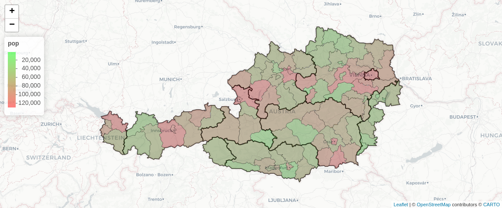
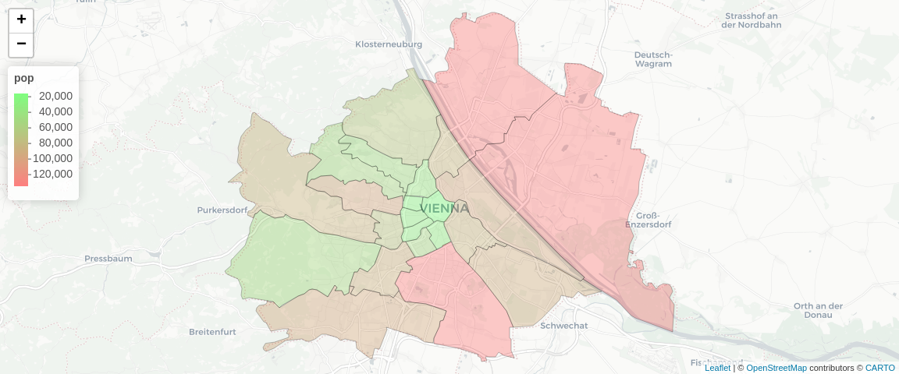

# nutsr

An R package for austrian nuts regions, munacipies and districts. Aimed
to simplify your work with spatial variables in data analysis projects.

## Installation and setup

The package can be installed directly from github

``` r
remotes::install_github('GregorDeCillia/nutsr')
```

Optional: Set up a cache with conversion rules and region polygons This
cache are used throughout the package. Requires an active internet
connection. See below for data sources and usecases. If this step is
skipped, the cache will be populated on demand.

``` r
library(nutsr)
nutsr_cache_dir('~/.cache/nutsr')
cache_conversion_rules()
#> cached 6 'data.frame' objects in '~/.cache/nutsr'
cache_region_shapes()
#> cached 3 'sf' objects in '~/.cache/nutsr'
```

## Conversion rules for regions

`nutsr` gives access to conversion rules for all nuts1, nuts2 and nuts3
regions as well as munacipies (`iso3`) and districts (`iso5`). This data
has been collected via the
[`{STATcubeR}`](https://statistikat.github.io/STATcubeR/) package.
Conversion rules are data frames with three columns: code, parent and
name. They provide a custom `summary()` method.

``` r
head(nuts2(), 4)
#> # A tibble: 4 × 3
#>   code  parent name            
#>   <chr> <chr>  <chr>           
#> 1 AT11  AT1    Burgenland      
#> 2 AT12  AT1    Niederösterreich
#> 3 AT13  AT1    Wien            
#> 4 AT21  AT2    Kärnten

summary(nuts1())
#> 3 conversion rules between nuts1 and nuts0

summary(nuts2())
#> 9 conversion rules between nuts2 and nuts1

summary(nuts3())
#> 36 conversion rules between nuts3 and nuts2

summary(iso1())
#> 9 conversion rules between iso1 and nuts2

summary(iso3())
#> 93 conversion rules between iso3 and iso1

summary(iso5())
#> 2117 conversion rules between iso5 and iso3
```

## Utility functions for data analysis

`nutsr` provides several utility functions to make data analysis easier.
All these utility functions make use of the tables above.

#### Convert codes to labels or vice versa

``` r
region_labels(c('AT1', 'AT11', 'AT111', '10101'))
#> [1] "Ostösterreich"    "Burgenland"       "Mittelburgenland" "Eisenstadt"

region_codes(c("Ostösterreich", "Burgenland", "Mittelburgenland", "Eisenstadt"))
#> [1] "AT1"   "AT11"  "AT111" "10101"
region_codes("Burgenland", prefer = "iso")
#> [1] "1"
```

#### Get information about hierarchies

``` r
region_parents(c('AT1', 'AT11', 'AT111', '10101'))
#> [1] "AT"   "AT1"  "AT11" "101"

region_levels(c('AT1', 'AT11', 'AT111', '1', '101', '10101'))
#> [1] "nuts1" "nuts2" "nuts3" "iso1"  "iso3"  "iso5"
```

## Data visualization

Visualize regional data with `nuts_map()`. This will create a
[`{leaflet}`](https://rstudio.github.io/leaflet/) map for the regions.

``` r
library(sf)
y <- iso3_pop()
nuts_map(y)
```

<!-- -->

``` r
library(dplyr)
iso5_pop() %>% 
  filter(substr(iso, 1, 1) == 9) %>% 
  nuts_map(overlay_nuts2 = FALSE)
```

<!-- -->

## Similar projects

The [`{eurostat}`](https://ropengov.github.io/eurostat/) package
contains information about nuts1, nuts2 and nuts3 regions for all EU27
countries, including austria.

``` r
?eurostat::add_nuts_level
?eurostat::recode_to_nuts_2016
?eurostat::get_eurostat_geospatial
```
